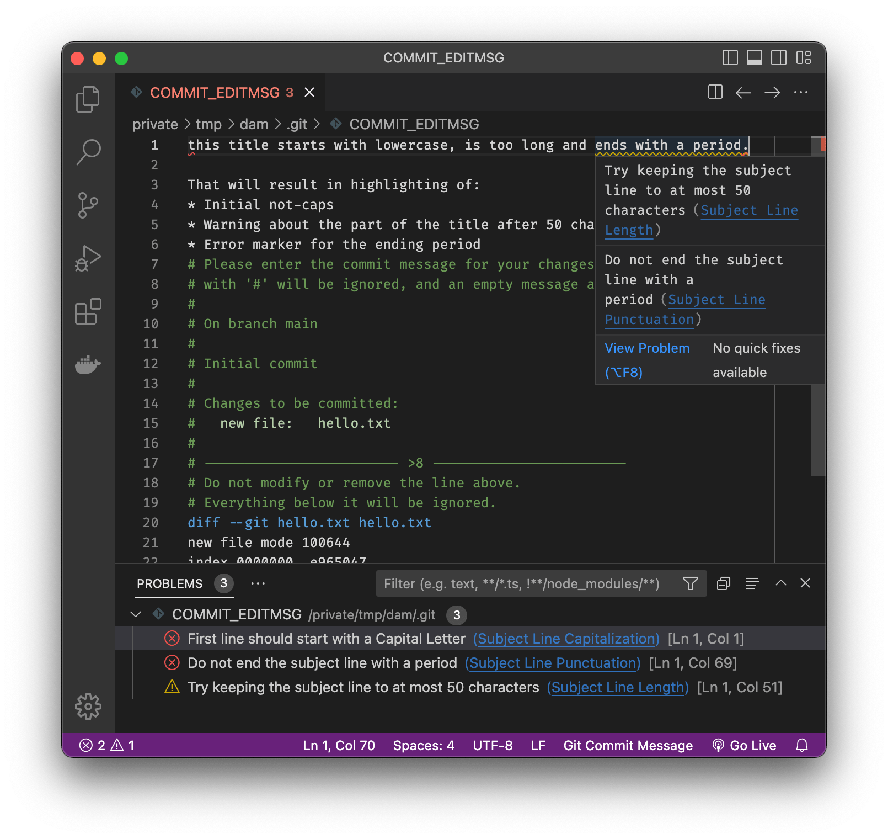

# Git Commit Message Plus

A git commit message highlighter being nicer than the built-in one.

Highlighting inspiration from <https://cbea.ms/git-commit>.

## Features

- Highlight file names and what's happening to them
- Quick Fixes for certain diagnostics
- Inform about `git commit -v` if it isn't being used
- `git commit -v` diff highlighting [even when running `git` in
  not-English](https://github.com/textmate/git.tmbundle/issues/60).
- Diagnostics for:
  - \> 50 characters subject lines
  - \> 72 characters subject lines
  - Not-capitalized subject lines (with Quick Fix)
  - Trailing punctuation in the subject line (with Quick Fix)
  - Non-blank second lines

<!-- FIXME: Add an animated demo here! -->



### Internal

- Comes with tests using <https://github.com/PanAeon/vscode-tmgrammar-test>
- Comes with unit tests for the diagnostics

### TODO

- Highlight current branch name in the Git metadata
- Validate code formatting in CI and fail on violations
- Fail CI on linter warnings
- Move all tests under the same top subdirectory

## Development

To run the unit tests:

```
npm install && npm test
```

To install into VSCode:

1. `npm run package`
1. In VSCode:
   - Click Extensions
   - Click the ... menu in the top right corner
   - Click Install from VSIX...

To check highlighting in VSCode: "Developer: Inspect Editor Tokens and Scopes"

To publish a new version:

```
npm run publish
```
