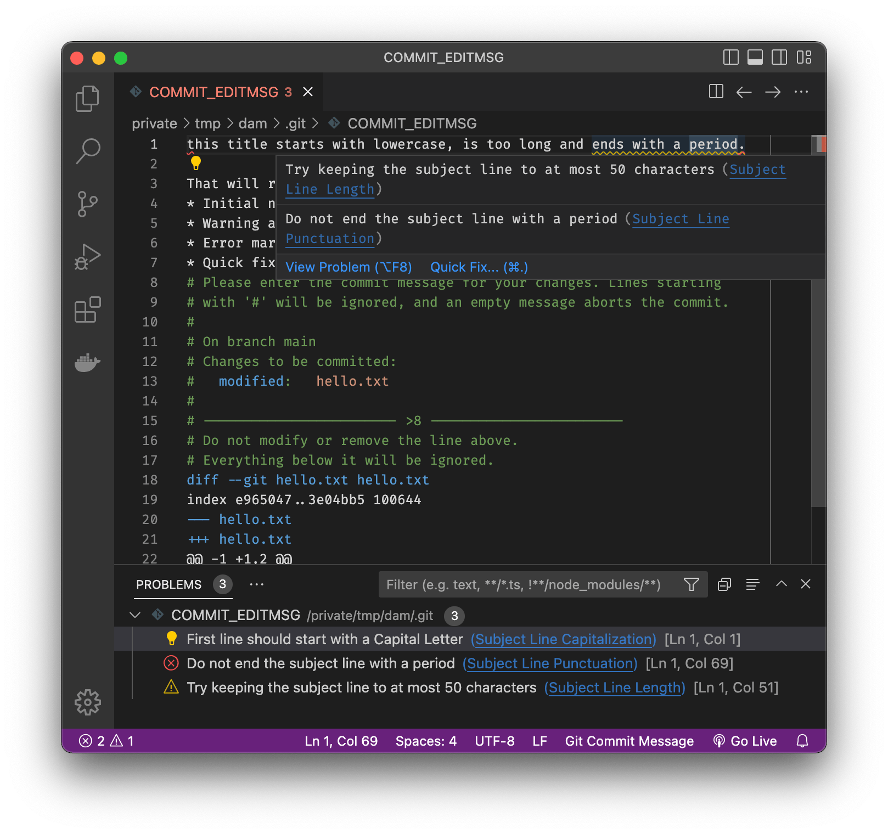

# Git Commit Message Plus

A git commit message highlighter being nicer than the built-in one.

Highlighting inspiration from <https://cbea.ms/git-commit>.

## Features

- Proper `git commit -v` diff highlighting [even when running `git` in
  not-English](https://github.com/textmate/git.tmbundle/issues/60).
- Report > 72 characters subject lines as errors
- Report > 50 characters subject lines as warnings
- Report not-capitalized subject lines as errors
- Report errors for trailing punctuation
- Report errors for non-blank second lines
- Highlight file names and what's happening to them

<!-- FIXME: Add an animated demo here! -->



### Internal

- Comes with tests using <https://github.com/PanAeon/vscode-tmgrammar-test>
- Comes with unit tests for the diagnostics

### TODO

- Mark commit message subject line as `markup.heading`, it _is_ a heading after
  all. Maybe plain after character 50? And then `markup.strikethrough` for
  characters 73 and onwards?
- Highlight more stuff in the Git metadata
- Add Quick Fixes for some of our diagnostics
- Make an icon
- Make sure diagnostics are applied to newly opened files, not just on file
  edits
- Have unit tests that don't launch VSCode
- Move all tests under the same top subdirectory
- `npm test` in CI
- Validate code formatting in CI

## Development

To run the unit tests:

```
npm install && npm test
```

To install into VSCode:

1. `npm run package`
1. In VSCode:
   - Click Extensions
   - Click the ... menu in the top right corner
   - Click Install from VSIX...

To check highlighting in VSCode: "Developer: Inspect Editor Tokens and Scopes"

To publish a new version:

```
npm run publish
```


[git-rebase]: https://github.com/microsoft/vscode/blob/b5aa3e0a3d3cdac2c44c022182ca2f238949a444/extensions/git-base/package.json#L60-L73